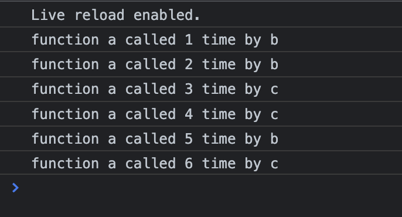

# Problem

Create function named `a` in `uniqueA.js` file which maintain count of no of times this function is called.
Then create 2 files `uniqueB.js` and `uniqueC.js` which will call that initially 2 times and then 1 time again and it should print that 

# Approach Used

- Created a closure function in A and exported that closure function
- B and C are importing that function and calling that

# How to Run App

Use any web server or Live server extension to run `index.html` \
P.S. Don't open it directly on any browser as it will leads to `CORS` issue because of `type = module` used in `script` tag

# Result

